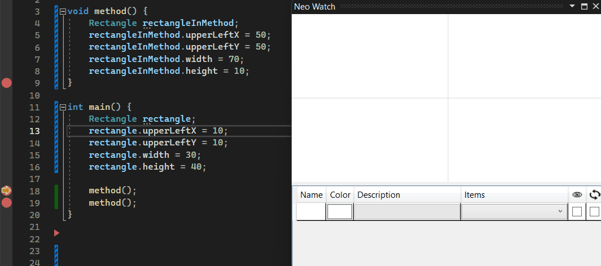

# Getting started

## NatVis

[Create custom views of C++ objects in the debugger using the Natvis framework](https://learn.microsoft.com/en-us/visualstudio/debugger/create-custom-views-of-native-objects?view=vs-2022)

❗️Always define a ***Parse*** field that matches any of the patterns.

❗️Use the same pattern on the DisplayString.

Table of supported types with their default patterns:

| Type | Pattern |
|-|-|
| Point | `Pnt: ({x},{y})` |
| Line | `Seg: {initialPoint} - {finalPoint}` |
| Arc | `Arc: C: {centerPoint} R: {radius} AngIni: {initialAngle} AngPaso: {sweepAngle}` |
| List | `List` |

### Samples

#### Point

```cpp
class Point
{
public:
    double x;
    double y;
};
```

```xml
<Type Name="Point">
  <DisplayString>Pnt: ({x},{y})</DisplayString>
  <Expand>
    <Synthetic Name="Parse">
      <DisplayString>Pnt: ({x},{y})</DisplayString>
    </Synthetic>
  </Expand>
</Type>
```

#### Segment

```cpp
class Segment
{
public:
    Point initialPoint;
    Point finalPoint;
};
```

```xml
<Type Name="Segment">
  <DisplayString>Seg: {initialPoint} - {finalPoint}</DisplayString>
  <Expand>
    <Synthetic Name="Parse">
      <DisplayString>Seg: {initialPoint} - {finalPoint}</DisplayString>
    </Synthetic>
  </Expand>
</Type>
```

#### Arc

```cpp
class Arc
{
public:
    Point centerPoint;
    float initialAngle;
    float sweepAngle;
    float radius;
};
```

```xml
<Type Name="Arc">
  <DisplayString>Arc: C: {centerPoint} R: {radius} AngIni: {initialAngle} AngPaso: {sweepAngle}</DisplayString>
  <Expand>
    <Synthetic Name="Parse">
      <DisplayString> Arc: C: {centerPoint} R: {radius} AngIni: {initialAngle} AngPaso: {sweepAngle} </DisplayString>
    </Synthetic>
  </Expand>
</Type>
```

#### Rectangle

```cpp
class Rectangle
{
public:
    float upperLeftX;
    float upperLeftY;
    float width;
    float height;
};
```

```xml
<Type Name="Rectangle">
  <DisplayString>List</DisplayString>
  <Expand>
    <Synthetic Name="[0]">
      <DisplayString>Seg: Pnt: ({upperLeftX},{upperLeftY}) - Pnt: ({upperLeftX + width},{upperLeftY})</DisplayString>
    </Synthetic>
    <Synthetic Name="[1]">
      <DisplayString>Seg: Pnt: ({upperLeftX + width},{upperLeftY}) - Pnt: ({upperLeftX + width},{upperLeftY + height})</DisplayString>
    </Synthetic>
    <Synthetic Name="[2]">
      <DisplayString>Seg: Pnt: ({upperLeftX + width},{upperLeftY + height}) - Pnt: ({upperLeftX},{upperLeftY + height})</DisplayString>
    </Synthetic>
    <Synthetic Name="[3]">
      <DisplayString>Seg: Pnt: ({upperLeftX},{upperLeftY + height}) - Pnt: ({upperLeftX},{upperLeftY})</DisplayString>
    </Synthetic>
  </Expand>
</Type>
```

## Installation

*Extensions* > *Manage Extensions...* > *Search: **Neo Watch***

# Usage

*Debug* > *Windows* > ***Neo Watch***



# Roadmap

- [ ] Custom natvis patterns.
- [ ] More concurrent elements support.
- [ ] Fast variable adding.
- [ ] Dark mode.
- [ ] Faster expression loading.
