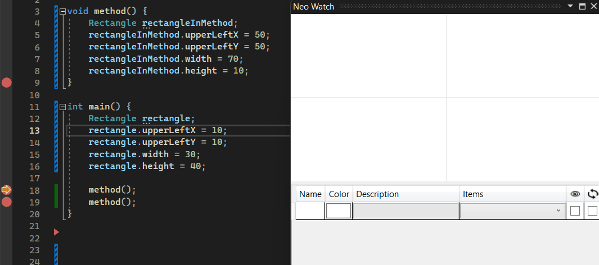

# Getting started

## NatVis

[Create custom views of C++ objects in the debugger using the Natvis framework](https://learn.microsoft.com/en-us/visualstudio/debugger/create-custom-views-of-native-objects?view=vs-2022)

❗️Always define a ***Parse*** field that matches any of the patterns.

❗️Use the same pattern on the DisplayString.

Table of supported types with their default patterns:

| Type | Pattern |
|-|-|
| Point | `Pnt: ({x},{y})` |
| Line | `Seg: {initialPoint} - {finalPoint}` |
| Arc | `Arc: C: {centerPoint} R: {radius} AngIni: {initialAngle} AngPaso: {sweepAngle}` |
| List | `List` |

[Check Wiki for more insigths on NatVis](https://github.com/txiribimakula/neo-watch/wiki/NatVis)

## Memory Blueprints (Experimental)

Enable **Tools > Options > Neo Watch > General > Enable memory blueprint loader**
to read supported native containers directly from memory. The bundled MSVC demo
blueprints cover `f10Points`, `stressPoints`, `stressSegments`, `stressArcs`,
`mixedChain`, `chainNodes` and `chainNodeStorage`. Blueprints match container types,
not variable names. Existing saved settings are not overwritten by updated defaults.

For your own types, use **Copy AI prompt** in that settings page (or **Tools >
Copy Neo Watch Blueprint Prompt** on older Visual Studio versions). Paste the prompt
into your AI and add the exact debugger type, C++ declarations and compiler details.
Append the resulting INI section to **Memory blueprints**, preserving the others.
Copying only puts a generic prompt on the clipboard; it does not send code anywhere.
Verify a small sample against native Watch/NatVis: structural checks cannot detect
a semantically wrong mapping such as swapped X/Y fields or radians used as degrees.

## Installation

*Extensions* > *Manage Extensions...* > *Search: **Neo Watch***

# Usage

*Debug* > *Windows* > ***Neo Watch***

